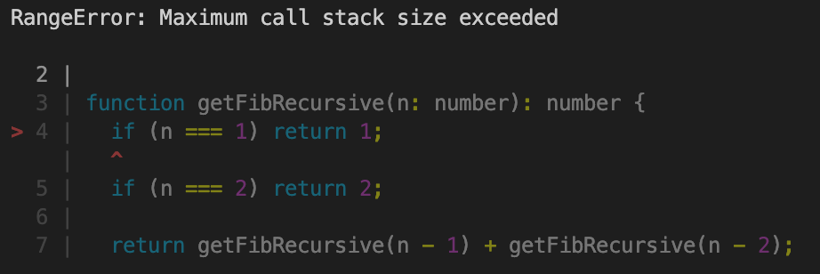

# Task

Return fibonacci sequence: 0, 1, 1, 2, 3, 5, 8, 13
Where F(0)=0, F(1)=1, F(2)=1, F(3)=2 ...

# Observation

## Copilot result

> prompt: Create fibonacci function

```typescript
function fibonacci(n: number): number {
  if (n <= 1) {
    return n;
  } else {
    return fibonacci(n - 1) + fibonacci(n - 2);
  }
}
```

- 🟡 Excess "else" operator, return at the end doesn't require this
- ✅ All unit tests succeed on a first attempt, and don't require fixing
- ✅ Return numbers are [0, 1, 1, 2, 3, 5, 8, 13]

## Public example 1

> source: https://javascript.plainenglish.io/the-fibonacci-sequence-in-typescript-4401bd3b9d1f

```typescript
function fibonacci(num: number): number {
  if (num <= 1) {
    return 1;
  }
  return fibonacci(num - 1) + fibonacci(num - 2);
}
```

- 🔴 Error, condition "if (num <= 1) return 1" makes it F(0)=1, which isn't right for Fibonacci sequence and it shifts sequence by 1 index.
- 🔴 Result is [1, 1, 2, 3, 5, 8, 13, 21]

## Public example 2

> source https://rahulbansalc6414.medium.com/fibonacci-program-part-2-with-typescript-2334818c1b69

```typescript
function getFibRecursive(n: number): number {
  if (n === 1) return 1;
  if (n === 2) return 2;
  return getFibRecursive(n - 1) + getFibRecursive(n - 2);
}
```

- 🔴 Doesn't support F(0), throws an error



- 🔴 Error, when previous error fixed by adding "if (n <= 0) return 0", result is incorrect.
- 🔴 Result is [0, 1, 2, 3, 5, 8, 13, 21]

# Conclusion

Although copilot result produce extra else statement, it is the only example which worked out of box following requirement
Other examples found after first 7 google search results was duplicating copilot solution with and without "else" operator refactoring
Examples described above was first in google search
